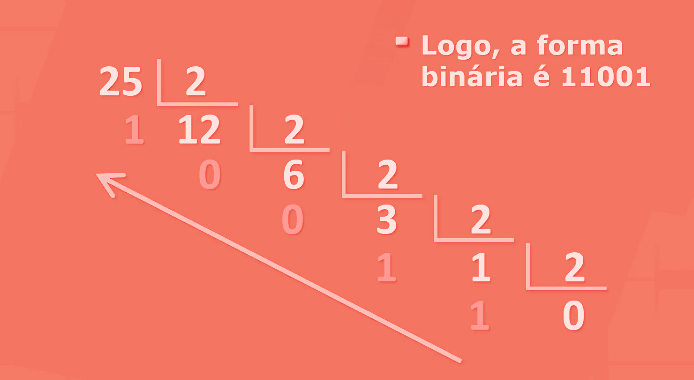
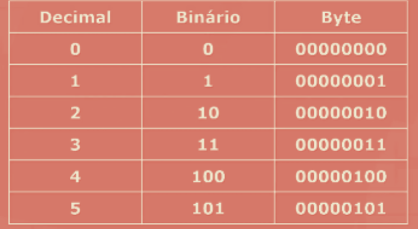

# conversor de números decimais em binários
A conversão de números decimais em binários é realizada por meio da divisão sucessiva do número decimal por 2, anotando-se o resto de cada divisão e invertendo a ordem deles para obter a representação binária do número.

 

## O que e binário na programação?
O código binário é um sistema de representação de dados e informações que usa apenas dois dígitos, 0 e 1. É um sistema de base 2, o que significa que cada dígito ou “bit” tem dois valores possíveis: 0 ou 1.

## Para que serve o sistema de numeração binário?
O sistema binário é usado pelos computadores é e constituído de dois dígitos o 0 e o 1. A combinação desses dígitos leva o computador a criar várias informações: letras, palavras, textos, cálculos.